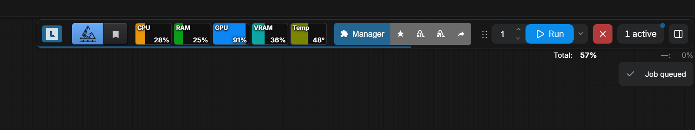
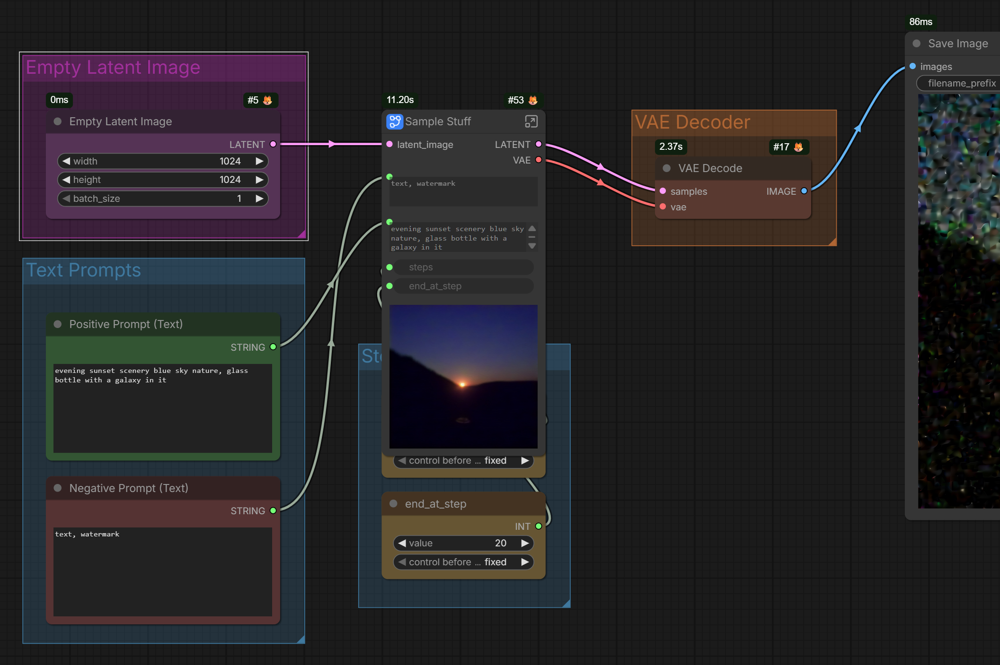
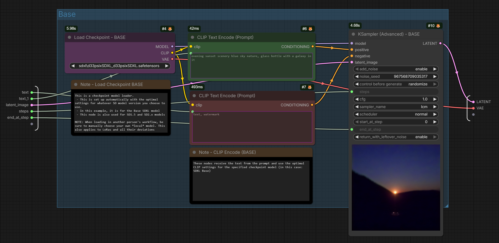
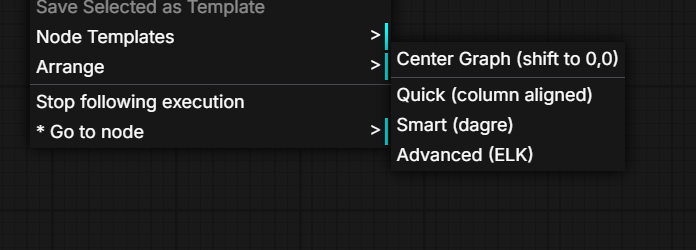
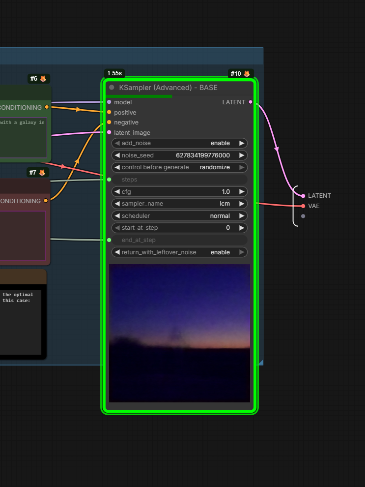
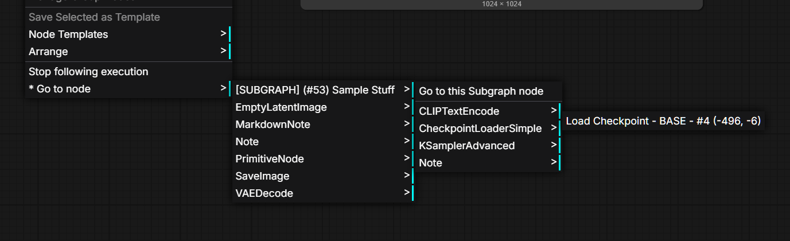
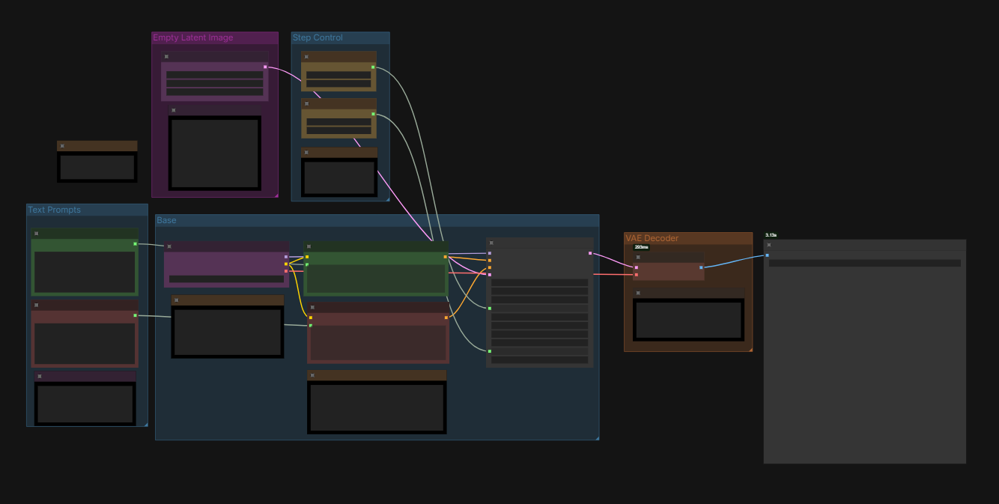
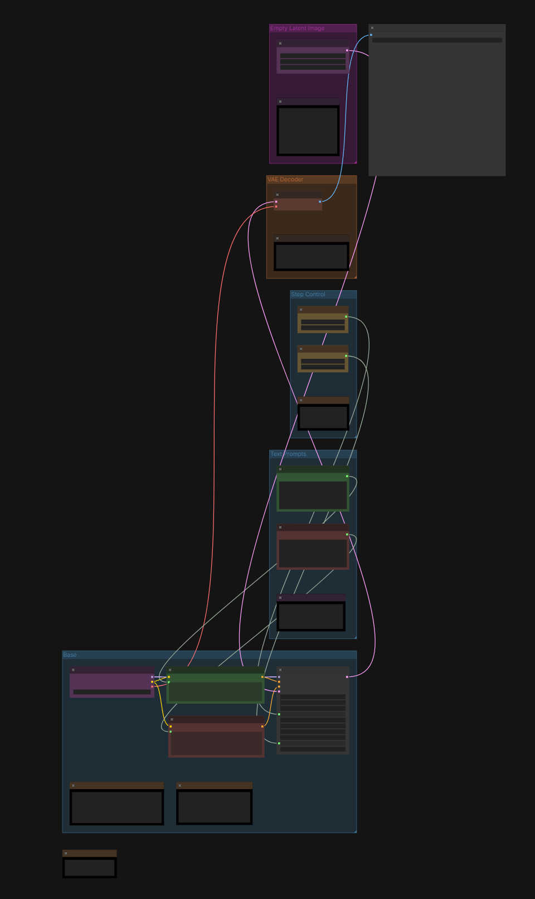
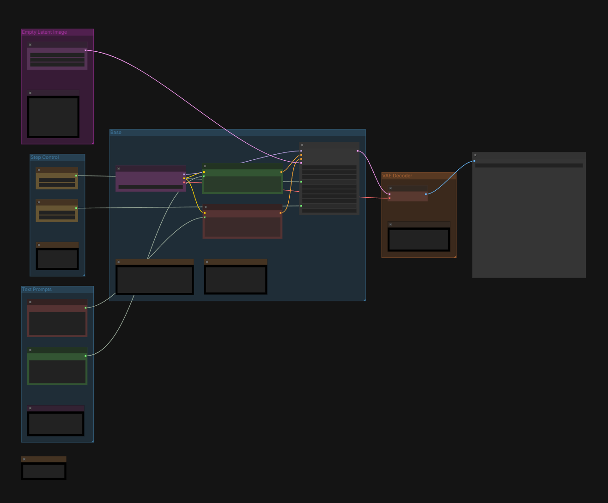
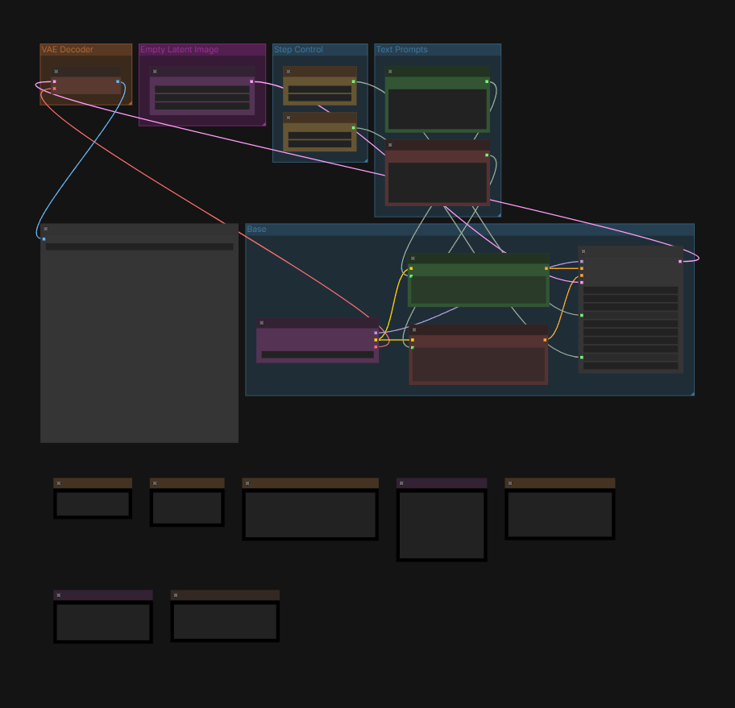

# ComfyUI Enhancement Utils

A curated collection of enhancement utilities for ComfyUI, combining and improving features from several community packages into a single, well-organized package built on the V3 API (`comfy_api`).

> **Full Subgraph Support** -- Every feature in this package works inside subgraphs. Graph arrangement, node navigation, execution profiling, and running-node highlights all handle nested subgraphs correctly. None of the original packages these features were drawn from support subgraphs.

## Features

### Resource Monitor

Real-time system stats displayed as horizontal colored bars in the ComfyUI menu bar.



| Metric | Color | Details |
|--------|-------|---------|
| **CPU** | Amber | CPU utilization percentage |
| **RAM** | Green | RAM used / total (tooltip shows bytes) |
| **Disk** | Muted purple | Disk usage for a selected partition |
| **GPU** | Blue | GPU utilization percentage (NVIDIA only) |
| **VRAM** | Teal | VRAM used / total with max-used tracking in tooltip |
| **Temperature** | Green-to-red gradient | GPU temperature in degrees |


**GPU support:**
- NVIDIA GPUs via optional `pynvml`
- Graceful fallback if no NVIDIA GPU or `pynvml` not installed
- Respects `CUDA_VISIBLE_DEVICES` -- only monitors GPUs ComfyUI can use
- Safe ZLUDA detection (won't crash on AMD GPUs faking CUDA)
- GPU names decoded safely (no `UnicodeDecodeError` on unusual drivers)


---

### Node Profiler

Displays execution time badges on nodes after a workflow runs.



- **Per-node timing** -- a small badge above each node shows how long it took to execute (e.g., `1.23s` or `456ms`)
- **Subgraph totals** -- subgraph container nodes show the aggregated time of all their internal nodes, updating live as children complete
- **Persistent data** -- profiling badges survive navigating into/out of subgraphs and switching between workflows. Data only clears when the workflow is run again.

Badges also display inside subgraphs:



Enabled by default. Toggle in ComfyUI Settings: **Node Profiler - Enabled**.

---

### Node Navigation

**Right-click canvas** (added to the bottom of the context menu)

| Option | Description |
|--------|-------------|
| **Go to Node** | Hierarchical submenu listing all nodes grouped by type. Click any node to center the viewport on it. Supports subgraph navigation -- clicking a node inside a subgraph will navigate into that subgraph first. |
| **Follow Execution** | Toggle that auto-pans the canvas to track the currently executing node in real time. |
| **Show Executing Node** | One-shot jump to whichever node is currently running (only appears during execution). |



Additionally draws a **green border** around the currently executing node.



---

### Graph Arrange

**Right-click canvas > Arrange**



Multiple auto-layout algorithms for organizing your workflow, all with full group and subgraph support:

| Option | Description |
|--------|-------------|
| **Center Graph (shift to 0,0)** | Shifts all nodes and groups so the graph is centered at the origin. Useful when navigating between subgraphs leaves you lost in empty space. |
| **Quick (column aligned)** | Fast column-based layout with right-aligned nodes and barycenter sorting for reduced edge crossings. No external library needed. |
| **Smart (dagre)** | Sugiyama layered layout via [dagre.js](https://github.com/dagrejs/dagre). Good balance of quality and speed. |
| **Advanced (ELK)** | Port-aware Sugiyama layout via the [Eclipse Layout Kernel](https://github.com/kieler/elkjs). Models each input/output slot as a port for optimal edge routing and crossing minimization. Best layout quality. |

**Before:**



**After:**

<table>
<tr>
<td align="center"><strong>Quick (column aligned)</strong></td>
<td align="center"><strong>Smart (dagre)</strong></td>
<td align="center"><strong>Advanced (ELK)</strong></td>
</tr>
<tr>
<td></td>
<td></td>
<td></td>
</tr>
</table>

All layout algorithms:
- **Respect groups** -- nodes inside groups are arranged within their group first, then groups are arranged as units
- **Work in subgraphs** -- arranges only the graph level you're currently viewing
- **Handle disconnected nodes** -- nodes with no connections are laid out in a compact grid below the main graph
- **Flatten nested groups** -- nested groups are treated as part of their outermost parent

**Settings** (ComfyUI Settings panel):

| Setting | Default | Description |
|---------|---------|-------------|
| Flow direction | LR | Left-to-Right or Top-to-Bottom. Affects Dagre and ELK. |
| Node spacing | 50 | Gap between nodes in the same rank/column. |
| Rank spacing | 80 | Gap between ranks (columns or rows). |
| Group padding | 30 | Padding inside groups around the arranged nodes. |

---

## Nodes

### Play Sound

Plays an audio file when execution reaches this node. Useful for alerting you when a long workflow completes.

| Input | Type | Description |
|-------|------|-------------|
| any | Any (passthrough) | Connect any output to trigger the sound. Passed through unchanged. |
| mode | Combo | `always` or `on empty queue` (only plays when the queue finishes). |
| volume | Float | Playback volume (0.0 - 1.0). |
| file | String | Sound file name (from assets/) or a full URL. Default: `notify.mp3`. |

| Output | Type | Description |
|--------|------|-------------|
| passthrough | Same as input | The input value, passed through unchanged. |

### System Notification

Sends a browser notification when execution reaches this node. The browser will request notification permission when the node is first added to the graph.

| Input | Type | Description |
|-------|------|-------------|
| message | String | The notification body text. |
| any | Any (passthrough) | Connect any output to trigger the notification. Passed through unchanged. |
| mode | Combo | `always` or `on empty queue`. |

| Output | Type | Description |
|--------|------|-------------|
| passthrough | Same as input | The input value, passed through unchanged. |

### Load Image (With Subfolders)

**Category: image** | **Node: Load Image (With Subfolders)**

An enhanced image loader that recursively scans the input directory for images, including all subfolders. Also extracts embedded metadata from PNG and WebP files.

| Input | Type | Description |
|-------|------|-------------|
| image | Combo (with upload) | Select an image from the input directory. Subfolders are fully supported and shown as `subfolder/filename.png`. |

| Output | Type | Description |
|--------|------|-------------|
| image | IMAGE | The loaded image tensor. Supports multi-frame (GIF, APNG, TIFF), 16-bit, and palette transparency. |
| mask | MASK | Alpha mask (or zeros if no alpha channel). |
| prompt | STRING | Embedded prompt metadata as JSON (empty `{}` if none found). |
| metadata | STRING | Full embedded metadata as JSON (PNG text chunks, WebP EXIF, JPEG EXIF). |

Improvements over other image loaders:
- **Recursive subfolder scanning** with `os.walk`
- **Content-type filtering** -- only shows actual image files (uses ComfyUI's MIME-type detection)
- **Truncated image recovery** -- uses `node_helpers.pillow()` for resilient loading
- **Multi-frame support** -- handles animated GIF/APNG, multi-page TIFF, MPO format
- **16-bit image support** -- properly normalizes `I` mode images
- **Palette transparency** -- handles `P` mode images with transparency info
- **Metadata extraction** -- PNG text chunks, WebP EXIF (via piexif), JPEG EXIF
- **SHA-256 caching** -- only re-executes when the file on disk actually changes
- Excludes system files (`Thumbs.db`, `.DS_Store`, `desktop.ini`) and dot-folders

---

## Installation

### ComfyUI Manager

Search for "Enhancement Utils" in the ComfyUI Manager.

### Manual

Clone the repository into your `custom_nodes` directory:

```bash
cd ComfyUI/custom_nodes
git clone https://github.com/phazei/ComfyUI-Enhancement-Utils.git
```

Install dependencies:

```bash
pip install -r requirements.txt
```

For NVIDIA GPU monitoring (optional):

```bash
pip install pynvml
```

---

## Dependencies

| Package | Required | Purpose |
|---------|----------|---------|
| `psutil` | Yes | CPU, RAM, and disk monitoring |
| `piexif` | Yes | WebP EXIF metadata extraction |
| `pynvml` | Optional | NVIDIA GPU monitoring (graceful fallback if missing) |
| `Pillow` | Yes (bundled with ComfyUI) | Image loading |
| `torch`, `numpy` | Yes (bundled with ComfyUI) | Tensor operations |

Vendored JavaScript libraries (no npm/build step required):
- [dagre 0.8.5](https://github.com/dagrejs/dagre) (~284KB) -- Sugiyama layout algorithm
- [elkjs 0.11.1](https://github.com/kieler/elkjs) (~1.5MB) -- Eclipse Layout Kernel

---

## Project Structure

```
ComfyUI-Enhancement-Utils/
├── __init__.py                    # V3 entrypoint (comfy_entrypoint)
├── pyproject.toml                 # Package metadata
├── LICENSE                        # MIT
│
├── nodes/
│   ├── play_sound.py              # PlaySound node
│   ├── system_notification.py     # SystemNotification node
│   └── image_load_subfolders.py   # ImageLoadWithSubfolders node
│
├── monitor/
│   ├── collector.py               # Background stats polling thread
│   ├── gpu.py                     # NVIDIA GPU abstraction layer
│   ├── hardware.py                # CPU/RAM/Disk stats via psutil
│   └── routes.py                  # HTTP API endpoints
│
├── profiler/
│   ├── __init__.py                # Module setup, triggers hooks on import
│   └── hooks.py                   # Monkey-patches for execution timing
│
└── web/js/
    ├── utils.js                   # Shared subgraph/exec-ID utilities
    ├── graphArrange.js            # Graph layout algorithms + menu
    ├── nodeNavigation.js          # Go to Node, Follow Execution
    ├── nodeProfiler.js            # Execution time badges + live timer
    ├── playSound.js               # PlaySound client handler
    ├── systemNotification.js      # Browser Notification handler
    ├── resourceMonitor.js         # Monitor UI (horizontal bars)
    ├── resourceMonitor.css        # Monitor styling
    ├── assets/notify.mp3          # Default notification sound
    └── lib/
        ├── dagre.min.js           # Vendored dagre library
        └── elk.bundled.min.js     # Vendored ELK library
```

All Python nodes use the **V3 schema** (`comfy_api.latest`) with `io.ComfyNode`, `define_schema()`, and `io.NodeOutput`. Frontend extensions are plain JavaScript (no build step).

---

## Acknowledgements

This package combines and improves upon work from:

- **[ComfyUI-Custom-Scripts](https://github.com/pythongosssss/ComfyUI-Custom-Scripts)** by [pythongosssss](https://github.com/pythongosssss) -- Original source for PlaySound, SystemNotification, Node Navigation (Go to Node, Follow Execution), and Graph Arrange (Float Left/Right). These features have been rewritten for the V3 API, with improvements including proper `MatchType` for wildcard passthrough (replacing the `AnyType(str)` hack), barycenter sorting for reduced edge crossings, and disconnected node handling.

- **[ComfyUI-Crystools](https://github.com/crystian/ComfyUI-Crystools)** by [crystian](https://github.com/crystian) -- Original source for the Resource Monitor and ImageLoadWithMetadata. The monitor has been rewritten with fixes for thread deadlocks (`asyncio.run()` in thread), GPU crash safety (ZLUDA detection, `UnicodeDecodeError` on GPU names), fast startup (platform-native CPU detection instead of `py-cpuinfo`), and `CUDA_VISIBLE_DEVICES` support. The image loader combines Crystools' subfolder scanning with ComfyUI's built-in robustness (multi-frame, truncated image recovery, palette transparency).

- **[dagre](https://github.com/dagrejs/dagre)** -- JavaScript library for directed graph layout using the Sugiyama algorithm. MIT licensed.

- **[elkjs](https://github.com/kieler/elkjs)** -- JavaScript port of the Eclipse Layout Kernel, providing advanced port-aware layered layout. EPL-2.0 licensed.

---

## License

MIT License. See [LICENSE](LICENSE) for details.
