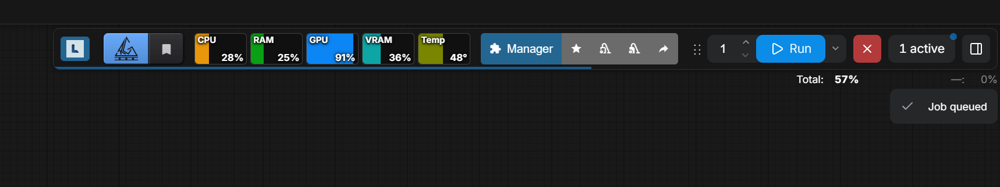
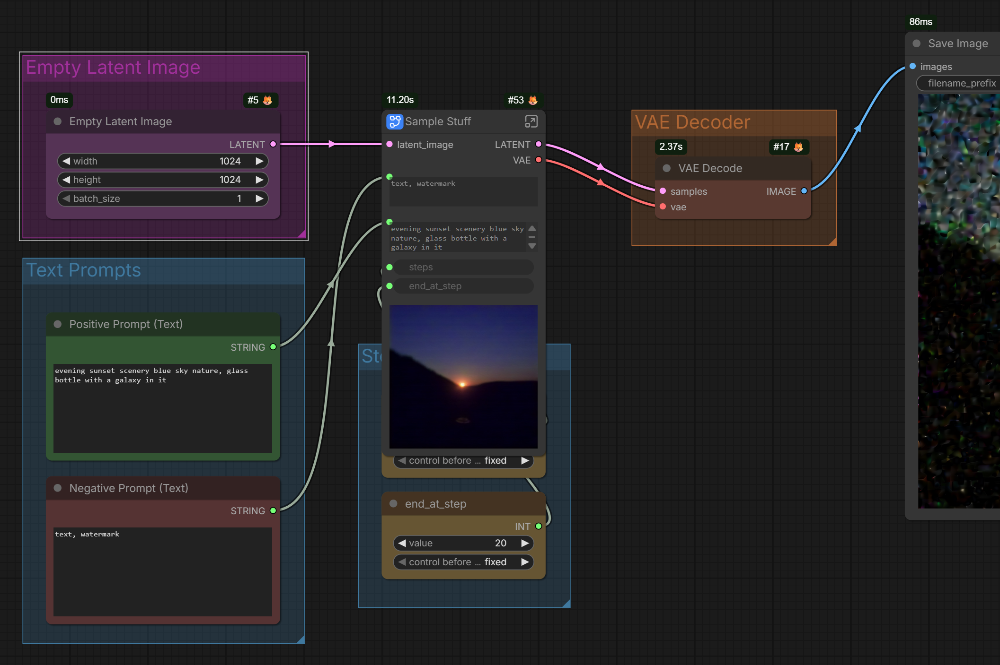
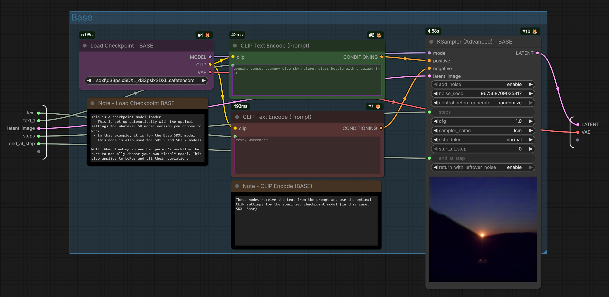
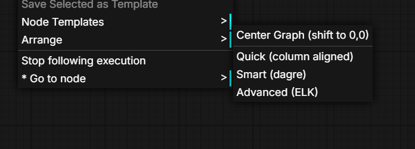
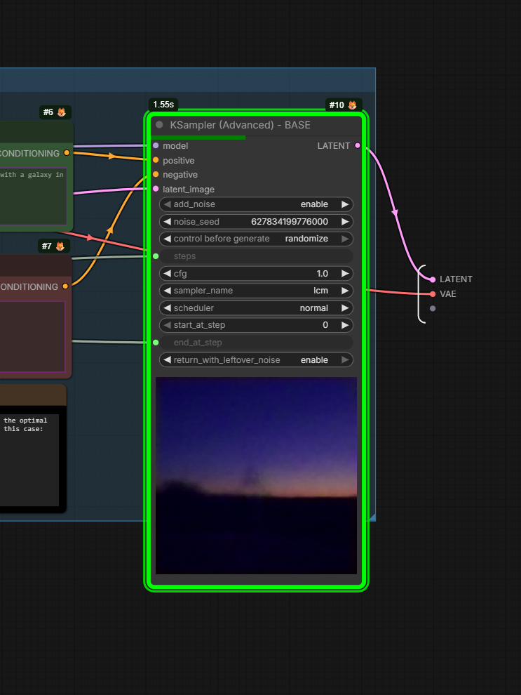
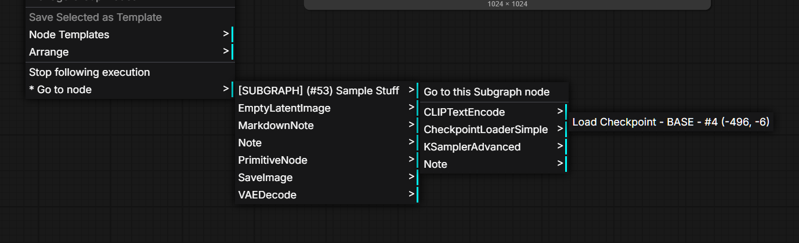
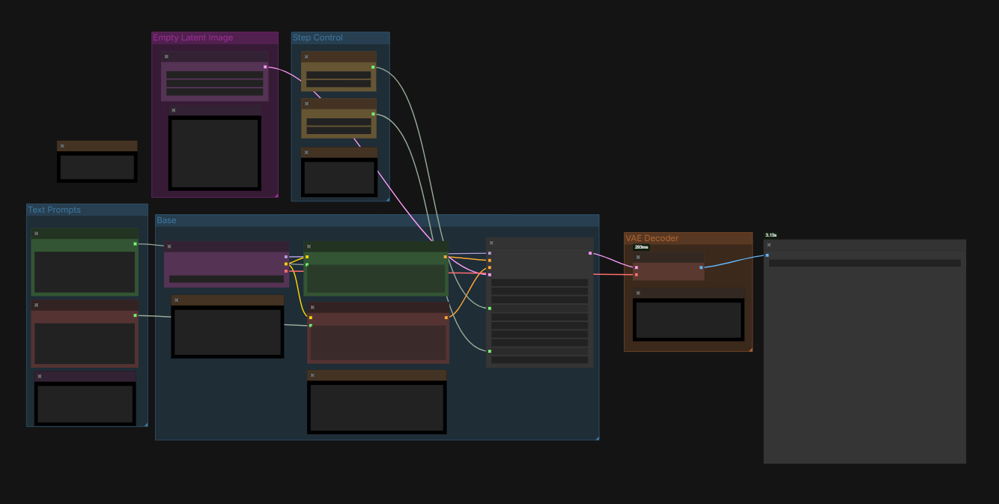
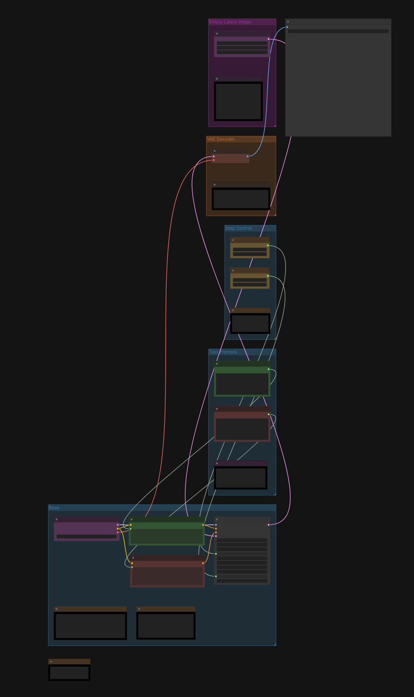
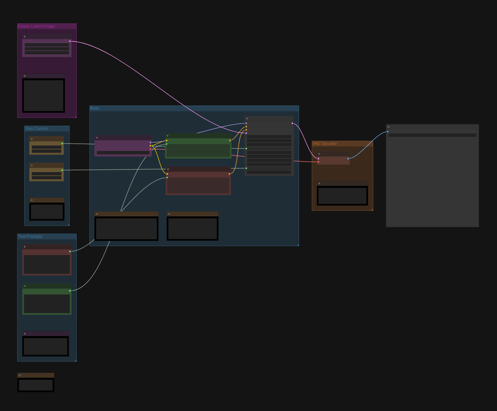
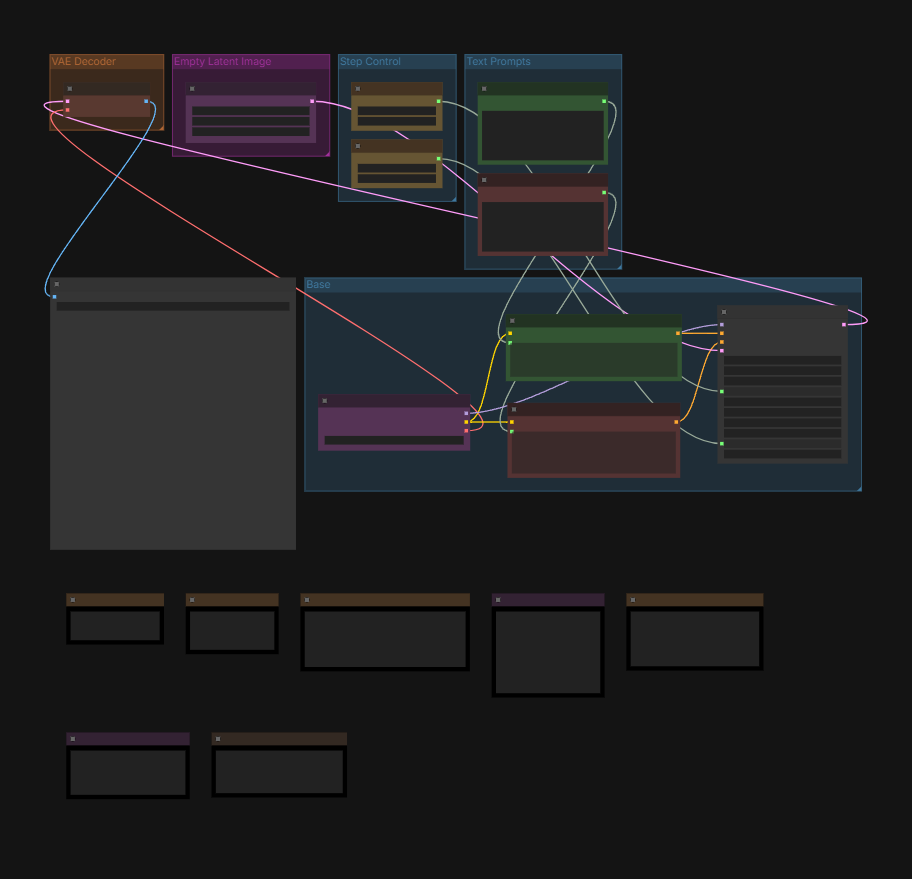

# ComfyUI Enhancement Utils

A curated collection of enhancement utilities for ComfyUI, combining and improving features from several community packages into a single, well-organized package built on the V3 API (`comfy_api`).

> **Full Subgraph Support** -- Every feature in this package works inside subgraphs. Graph arrangement, node navigation, execution profiling, and running-node highlights all handle nested subgraphs correctly. None of the original packages these features were drawn from support subgraphs.

> **Nodes 2.0 Compatible** -- Every feature works in both the legacy LiteGraph canvas renderer and the new Nodes 2.0 Vue renderer. Profiling badges, graph arrangement, node navigation, resource monitoring, and all nodes function correctly in either mode. (One minor exception: the image loader's custom-folder on-node preview and MaskEditor are legacy-canvas only -- see [Load Image (With Subfolders)](#load-image-with-subfolders).)

## Features

### Resource Monitor

Real-time system stats displayed as horizontal colored bars in the ComfyUI menu bar.



| Metric | Color | Display |
|--------|-------|---------|
| **CPU** | Amber | Utilization % |
| **RAM** | Green | Used / total (tooltip shows bytes) |
| **Disk** | Muted purple | Usage for a selected partition |
| **GPU** | Blue | Utilization % (NVIDIA only) |
| **VRAM** | Teal | Used / total, max-used tracking in tooltip |
| **Temp** | Green-to-red gradient | GPU temperature in degrees |
| **Power** | Red-orange | Current wattage (bar fill = % of TDP) |

**Historical graphs** -- hover any bar for a single-metric sparkline popup. Click any bar to pin a grid showing all metrics at once. Click again or click outside to dismiss.

**Electricity cost** -- session power consumption is tracked and displayed on the power bar tooltip and graph popup. Configure your electricity rate and currency symbol in settings.

**History persists through browser refresh** -- data is stored server-side in memory. Choose a display window (5 / 10 / 20 / 30 min, 1 hr, or Unlimited). Right-click the monitor bars to clear history.

**GPU support:**
- NVIDIA GPUs report utilization, VRAM, temperature and power via optional `nvidia-ml-py`
- AMD (ROCm/ZLUDA) and Intel (XPU) GPUs show a VRAM bar only -- utilization, temperature and power have no cross-platform API, so those bars are not shown
- Respects `CUDA_VISIBLE_DEVICES` -- only monitors GPUs ComfyUI can use
- Safe ZLUDA detection (won't crash on AMD GPUs faking CUDA)
- Falls back to CPU/RAM/disk only if no GPU is usable


---

### Node Profiler

Displays execution time badges on nodes after a workflow runs.



- **Per-node timing** -- a small badge above each node shows how long it took to execute (e.g., `1.23s` or `456ms`)
- **Subgraph totals** -- subgraph container nodes show the aggregated time of all their internal nodes, updating live as children complete
- **Persistent data** -- profiling badges survive navigating into/out of subgraphs, switching between workflows, and browser refreshes. Data is retained server-side and restored automatically on page load. Data only clears when the workflow is run again.

Badges also display inside subgraphs:



Enabled by default. Toggle in ComfyUI Settings: **Node Profiler - Enabled**.

To access profiling data programmatically within your workflow (e.g., for logging or conditional logic), use the [Profiler Timing](#profiler-timing) node. It can read the execution time of any node by linking to it or specifying its ID.

---

### Node Navigation

**Right-click canvas** (added to the bottom of the context menu)

| Option | Description |
|--------|-------------|
| **Go to Node** | Hierarchical submenu listing all nodes grouped by type. Click any node to center the viewport on it. Supports subgraph navigation -- clicking a node inside a subgraph will navigate into that subgraph first. |
| **Follow Execution** | Toggle that auto-pans the canvas to track the currently executing node in real time. |
| **Show Executing Node** | One-shot jump to whichever node is currently running (only appears during execution). |



Additionally draws a **green border** around the currently executing node.



---

### Graph Arrange

**Right-click canvas > Arrange**



Multiple auto-layout algorithms for organizing your workflow, all with full group and subgraph support:

| Option | Description |
|--------|-------------|
| **Center Graph (shift to 0,0)** | Shifts all nodes and groups so the graph is centered at the origin. Useful when navigating between subgraphs leaves you lost in empty space. |
| **Quick (column aligned)** | Fast column-based layout with right-aligned nodes and barycenter sorting for reduced edge crossings. No external library needed. |
| **Smart (dagre)** | Sugiyama layered layout via [dagre.js](https://github.com/dagrejs/dagre). Good balance of quality and speed. |
| **Advanced (ELK)** | Port-aware Sugiyama layout via the [Eclipse Layout Kernel](https://github.com/kieler/elkjs). Models each input/output slot as a port for optimal edge routing and crossing minimization. Best layout quality. |

**Before:**



**After:**

<table>
<tr>
<td align="center"><strong>Quick (column aligned)</strong></td>
<td align="center"><strong>Smart (dagre)</strong></td>
<td align="center"><strong>Advanced (ELK)</strong></td>
</tr>
<tr>
<td></td>
<td></td>
<td></td>
</tr>
</table>

All layout algorithms:
- **Respect groups** -- nodes inside groups are arranged within their group first, then groups are arranged as units
- **Work in subgraphs** -- arranges only the graph level you're currently viewing
- **Handle disconnected nodes** -- nodes with no connections are laid out in a compact grid below the main graph
- **Flatten nested groups** -- nested groups are treated as part of their outermost parent

**Settings** (ComfyUI Settings panel):

| Setting | Default | Description |
|---------|---------|-------------|
| Flow direction | LR | Left-to-Right or Top-to-Bottom. Affects Dagre and ELK. |
| Node spacing | 50 | Gap between nodes in the same rank/column. |
| Rank spacing | 80 | Gap between ranks (columns or rows). |
| Group padding | 30 | Padding inside groups around the arranged nodes. |

---

## Nodes

### Play Sound

Plays an audio file when execution reaches this node. Useful for alerting you when a long workflow completes.

| Input | Type | Description |
|-------|------|-------------|
| any | Any (passthrough) | Connect any output to trigger the sound. Passed through unchanged. |
| mode | Combo | `always` or `on empty queue` (only plays when the queue finishes). |
| volume | Float | Playback volume (0.0 - 1.0). |
| file | String | Sound file name (from assets/) or a full URL. Default: `notify.mp3`. |

| Output | Type | Description |
|--------|------|-------------|
| passthrough | Same as input | The input value, passed through unchanged. |

### System Notification

Sends a browser notification when execution reaches this node. The browser will request notification permission when the node is first added to the graph.

| Input | Type | Description |
|-------|------|-------------|
| message | String | The notification body text. |
| any | Any (passthrough) | Connect any output to trigger the notification. Passed through unchanged. |
| mode | Combo | `always` or `on empty queue`. |

| Output | Type | Description |
|--------|------|-------------|
| passthrough | Same as input | The input value, passed through unchanged. |

### Profiler Timing

Reads execution timing data from the profiler and outputs it as float values. Wire inline via the pass-through to guarantee execution order.


| Input | Type | Description |
|-------|------|-------------|
| any | Any (passthrough) | Connect any output to place this node inline in the workflow. Data passes through unchanged. |
| node_link | Any (optional) | Connect any output from a node to measure that node's execution time. The data itself is ignored. |
| node_ids | String (optional) | Comma-separated node IDs to look up (e.g. `43,32:234,54`). Plain IDs resolve relative to the current subgraph first, then root. Subgraph container IDs return the total of all nodes inside. |

| Output | Type | Description |
|--------|------|-------------|
| passthrough | Same as input | The `any` input forwarded unchanged (type-matched). |
| elapsed | Float | Wall-clock seconds since execution started. Unique to each instance based on where it sits in the workflow. |
| node_time | Float | Execution time in seconds for the resolved node(s). Summed if multiple IDs are provided. Returns 0.0 for cached or unresolved nodes. |

**ID resolution order** (for plain IDs like `54` when the node is inside subgraph `123`):
1. Same subgraph level: `123:54`
2. Nested child: `123:*:54`
3. Root level: `54`
4. If the resolved ID is a subgraph container, returns the sum of all nodes inside it

Both `node_link` and `node_ids` are additive -- their resolved times are summed together.

---

### Load Image (With Subfolders)

**Category: image** | **Node: Load Image (With Subfolders)**

An enhanced image loader that recursively scans for images (including all subfolders) and extracts embedded metadata from PNG and WebP files. It works in two modes:

- **Default mode** -- pick from the ComfyUI input directory via the `image` dropdown (recursively scanned, subfolders shown as `subfolder/filename.png`).
- **Custom-folder mode** -- set `folder_path` to any folder on disk and pick from it via the `folder_image` dropdown.

Setting `folder_path` switches to custom-folder mode and overrides the `image` dropdown. The node automatically shows only the widgets relevant to the active mode.

| Input | Type | Description |
|-------|------|-------------|
| image | Combo (with upload) | Default mode. Select an image from the input directory. Subfolders are fully supported and shown as `subfolder/filename.png`. |
| folder_path | String (optional) | Absolute path, or a path relative to the input directory. When set, switches to custom-folder mode and scans the folder recursively. |
| folder_image | Combo (optional) | Custom-folder mode. The image to load from `folder_path`. Populated automatically when `folder_path` is set. |

| Output | Type | Description |
|--------|------|-------------|
| image | IMAGE | The loaded image tensor. Supports multi-frame (GIF, APNG, TIFF), 16-bit, and palette transparency. |
| mask | MASK | Alpha mask (or zeros if no alpha channel). |
| metadata | STRING | Full embedded metadata as JSON, including `prompt` and `workflow` (PNG text chunks, WebP EXIF, JPEG EXIF). Empty `{}` if none found. |
| imagedata | STRING | File stats as JSON: `filename`, `path` (directory only), `width`, `height`, `resolution`, `size_bytes`. |

> **Breaking change (v1.3.0+)** -- the standalone `prompt` output was removed. The embedded prompt now lives inside the `metadata` JSON (alongside `workflow`). Use the **Parse JSON (EnhUtils)** node to pull values back out as structured objects.

Improvements over other image loaders:
- **Custom-folder loading** -- load from any folder on disk (absolute or input-relative) via `folder_path`, scanned recursively
- **Recursive subfolder scanning** with `os.walk`
- **Live preview** -- the selected custom-folder image previews on the node and persists across workflow-tab switches and subgraph navigation (legacy canvas)
- **MaskEditor + Paste (Clipspace)** -- supported in custom-folder mode; the chosen image is copied to a temp location on demand (not on every selection), and re-opening MaskEditor reloads an existing mask (legacy canvas)
- **Primitive node support** -- the `folder_image` combo populates on a connected Primitive node, updating on page load, `folder_path` change, and global refresh
- **Content-type filtering** -- only shows actual image files (uses ComfyUI's MIME-type detection)
- **Truncated image recovery** -- uses `node_helpers.pillow()` for resilient loading
- **Multi-frame support** -- handles animated GIF/APNG, multi-page TIFF, MPO format
- **16-bit image support** -- properly normalizes `I` mode images
- **Palette transparency** -- handles `P` mode images with transparency info
- **Metadata extraction** -- PNG text chunks, WebP EXIF (via piexif), JPEG EXIF
- **SHA-256 caching** -- only re-executes when the file on disk actually changes
- Excludes system files (`Thumbs.db`, `.DS_Store`, `desktop.ini`), dot-folders, and the `clipspace` temp folder

> **Nodes 2.0 note** -- Custom-folder mode loads and outputs the selected image correctly in the Nodes 2.0 (Vue) renderer, but the on-node image preview does not update on `folder_image` change and MaskEditor is not supported in custom-folder mode there. Use the legacy canvas renderer for preview and MaskEditor with custom folders. Default mode works fully in both renderers.

---

### Parse JSON (EnhUtils)

**Category: utils** | **Node: Parse JSON (EnhUtils)**

Parses a JSON string into a native Python object (list, dict, number, etc.) so it can be consumed by nodes that accept any-type inputs. Pairs well with the `metadata`/`imagedata` outputs of **Load Image (With Subfolders)** and with scripting nodes like [rgthree](https://github.com/rgthree/rgthree-comfy)'s Power Puter.

| Input | Type | Description |
|-------|------|-------------|
| json_string | String (forced input) | A JSON string to parse into a Python object. |

| Output | Type | Description |
|--------|------|-------------|
| data | Any | The parsed Python object. |

---

### Execution Gate (EnhUtils)

**Category: utils** | **Node: Execution Gate (EnhUtils)**

A conditional pass-through that stops the rest of a branch from running when a boolean is false -- without erroring, and without forcing its own upstream to run. Typical use: an LLM generates text, a length/range check reduces it to a boolean, and the gate sits between the text and an expensive generator. Bad text skips the generator; the queue continues normally (auto-queue / "Run (Instant)" is not interrupted).

| Input | Type | Description |
|-------|------|-------------|
| enabled | Boolean | `true` passes `value` through. `false` blocks. Connect a computed boolean or toggle it manually. |
| value | Any (lazy, type-matched) | The value to pass through. **Only evaluated when `enabled` is true** -- when false, the nodes feeding it do not run. |

| Output | Type | Description |
|--------|------|-------------|
| value | Same as input | The original value when enabled, or a silent execution blocker when disabled. Downstream nodes are skipped, not errored. |

Because a silent block looks the same as any other reason a branch didn't run, the gate announces itself when it blocks: a warning toast in the UI ("Execution Gate: blocked") and an INFO line in the server console. Neither affects execution or stops auto-queue.

How it differs from Impact Pack's **Control Bridge** (Stop mode):
- **Not an output node.** Control Bridge is, which makes ComfyUI treat everything upstream of it as required -- so the LLM ran on every queue even when its text was discarded or disconnected. The gate is pruned like any normal node: if its output does not reach a real output, neither the gate nor anything feeding it executes.
- **Lazy `value`.** When `enabled` is false the `value` input is never requested, so its upstream nodes are skipped rather than executed and discarded.
- Uses only ComfyUI's native lazy-input and `ExecutionBlocker` mechanisms -- no mute/bypass manipulation, no node-ID lookups -- so it works unchanged inside subgraphs.

---

## Installation

### ComfyUI Manager

Search for "Enhancement Utils" in the ComfyUI Manager.

### Manual

Clone the repository into your `custom_nodes` directory:

```bash
cd ComfyUI/custom_nodes
git clone https://github.com/phazei/ComfyUI-Enhancement-Utils.git
```

Install dependencies:

```bash
pip install -r requirements.txt
```

For NVIDIA GPU monitoring (optional; usually already present since PyTorch pulls it in):

```bash
pip install nvidia-ml-py
```

`nvidia-ml-py` is NVIDIA's official package and provides the `pynvml` module. The separate `pynvml` package on PyPI is a deprecated shim that just depends on `nvidia-ml-py` and prints a `FutureWarning` -- don't install that one.

---

## Dependencies

| Package | Required | Purpose |
|---------|----------|---------|
| `psutil` | Yes | CPU, RAM, and disk monitoring |
| `piexif` | Yes | WebP EXIF metadata extraction |
| `nvidia-ml-py` | Optional | NVIDIA GPU monitoring via the `pynvml` module (graceful fallback if missing) |
| `Pillow` | Yes (bundled with ComfyUI) | Image loading |
| `torch`, `numpy` | Yes (bundled with ComfyUI) | Tensor operations |

Vendored JavaScript libraries (no npm/build step required):
- [dagre 0.8.5](https://github.com/dagrejs/dagre) (~284KB) -- Sugiyama layout algorithm
- [elkjs 0.11.1](https://github.com/kieler/elkjs) (~1.5MB) -- Eclipse Layout Kernel

---

## Project Structure

```
ComfyUI-Enhancement-Utils/
├── __init__.py                    # V3 entrypoint (comfy_entrypoint)
├── pyproject.toml                 # Package metadata
├── LICENSE                        # MIT
│
├── nodes/
│   ├── play_sound.py              # PlaySound node
│   ├── system_notification.py     # SystemNotification node
│   ├── image_load_subfolders.py   # ImageLoadWithSubfolders node
│   ├── profiler_timing.py         # ProfilerTiming node
│   ├── parse_json.py              # ParseJSON node
│   └── execution_gate.py          # ExecutionGate node (lazy conditional pass-through)
│
├── monitor/
│   ├── collector.py               # Background stats polling thread
│   ├── gpu.py                     # NVIDIA GPU abstraction layer
│   ├── hardware.py                # CPU/RAM/Disk stats via psutil
│   └── routes.py                  # HTTP API endpoints
│
├── profiler/
│   ├── __init__.py                # Module setup, triggers hooks on import
│   ├── hooks.py                   # Monkey-patches for execution timing
│   └── routes.py                  # HTTP API endpoint for profiler results
│
├── src/                           # Build source (not served by ComfyUI)
│   ├── nodeProfilerBadge.ts       # Vue-aware profiler badge (Nodes 2.0 compatible)
│   ├── vite.config.ts             # Vite build config
│   └── package.json               # Build dependencies
│
    └── js/                            # Served by ComfyUI (WEB_DIRECTORY = "./js")
        ├── utils.js                   # Shared subgraph/exec-ID utilities
        ├── graphArrange.js            # Graph layout algorithms + menu
        ├── nodeNavigation.js          # Go to Node, Follow Execution
        ├── nodeProfiler.js            # Execution time badges (both renderers)
        ├── playSound.js               # PlaySound client handler
        ├── systemNotification.js      # Browser Notification handler
        ├── executionGate.js           # Toast when an Execution Gate blocks
        ├── resourceMonitor.js         # Monitor UI (bars, settings, cost tracking)
        ├── resourceMonitorGraph.js    # Historical graph popup (Canvas 2D)
        ├── resourceMonitor.css        # Monitor + popup + context menu styling
        ├── assets/notify.mp3          # Default notification sound
        ├── built/                     # Vite build output (for future use)
        └── lib/
        ├── dagre.min.js           # Vendored dagre library
        └── elk.bundled.min.js     # Vendored ELK library
```

All Python nodes use the **V3 schema** (`comfy_api.latest`) with `io.ComfyNode`, `define_schema()`, and `io.NodeOutput`. Most frontend extensions are plain JavaScript (no build step). Extensions requiring Vue reactivity for Nodes 2.0 compatibility are built from TypeScript source in `src/` using Vite.

---

## Acknowledgements

This package combines and improves upon work from:

- **[ComfyUI-Custom-Scripts](https://github.com/pythongosssss/ComfyUI-Custom-Scripts)** by [pythongosssss](https://github.com/pythongosssss) -- Original source for PlaySound, SystemNotification, Node Navigation (Go to Node, Follow Execution), and Graph Arrange (Float Left/Right). These features have been rewritten for the V3 API, with improvements including proper `MatchType` for wildcard passthrough (replacing the `AnyType(str)` hack), barycenter sorting for reduced edge crossings, and disconnected node handling.

- **[ComfyUI-Crystools](https://github.com/crystian/ComfyUI-Crystools)** by [crystian](https://github.com/crystian) -- Original source for the Resource Monitor and ImageLoadWithMetadata. The monitor has been rewritten with fixes for thread deadlocks (`asyncio.run()` in thread), GPU crash safety (ZLUDA detection, `UnicodeDecodeError` on GPU names), fast startup (platform-native CPU detection instead of `py-cpuinfo`), and `CUDA_VISIBLE_DEVICES` support. The image loader combines Crystools' subfolder scanning with ComfyUI's built-in robustness (multi-frame, truncated image recovery, palette transparency).

- **[dagre](https://github.com/dagrejs/dagre)** -- JavaScript library for directed graph layout using the Sugiyama algorithm. MIT licensed.

- **[elkjs](https://github.com/kieler/elkjs)** -- JavaScript port of the Eclipse Layout Kernel, providing advanced port-aware layered layout. EPL-2.0 licensed.

---

## License

MIT License. See [LICENSE](LICENSE) for details.
